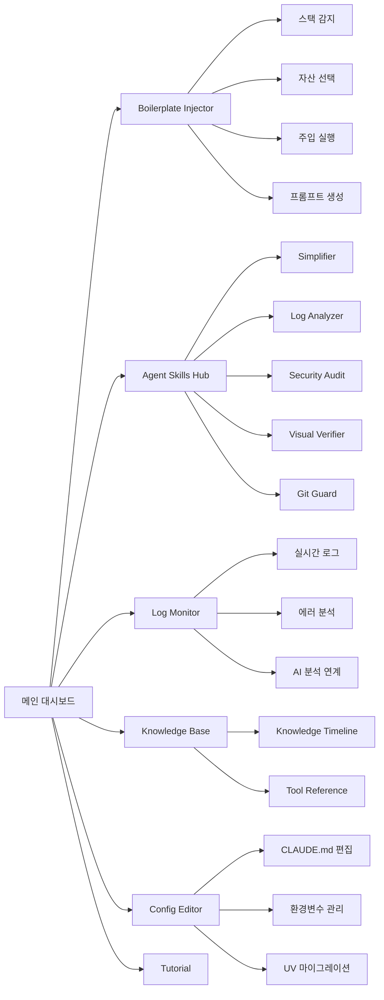
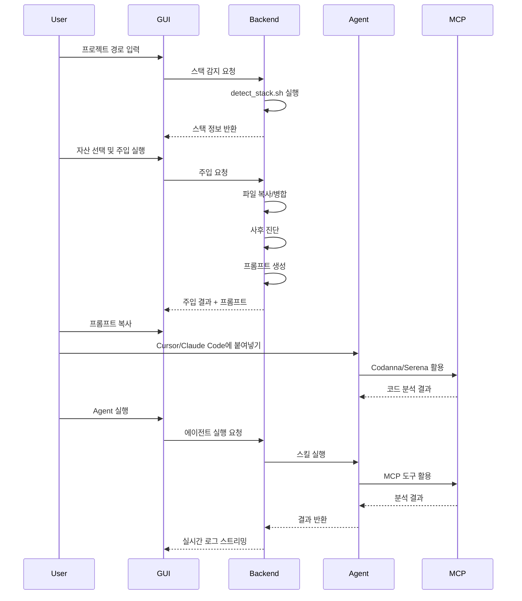
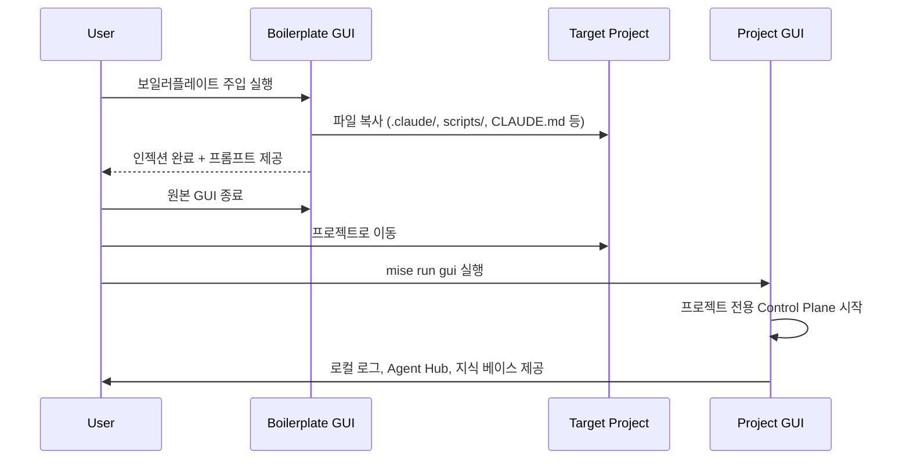
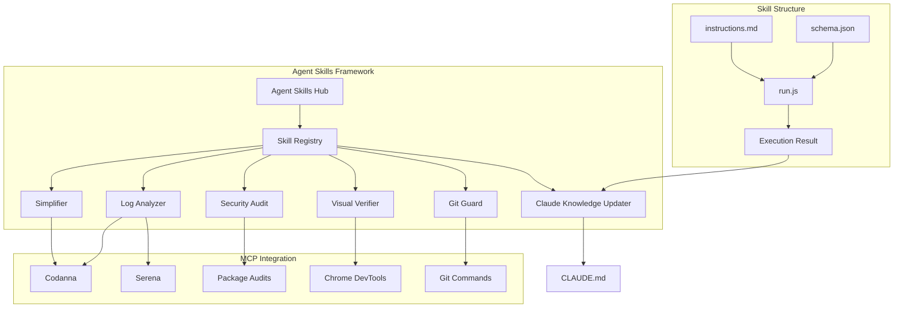
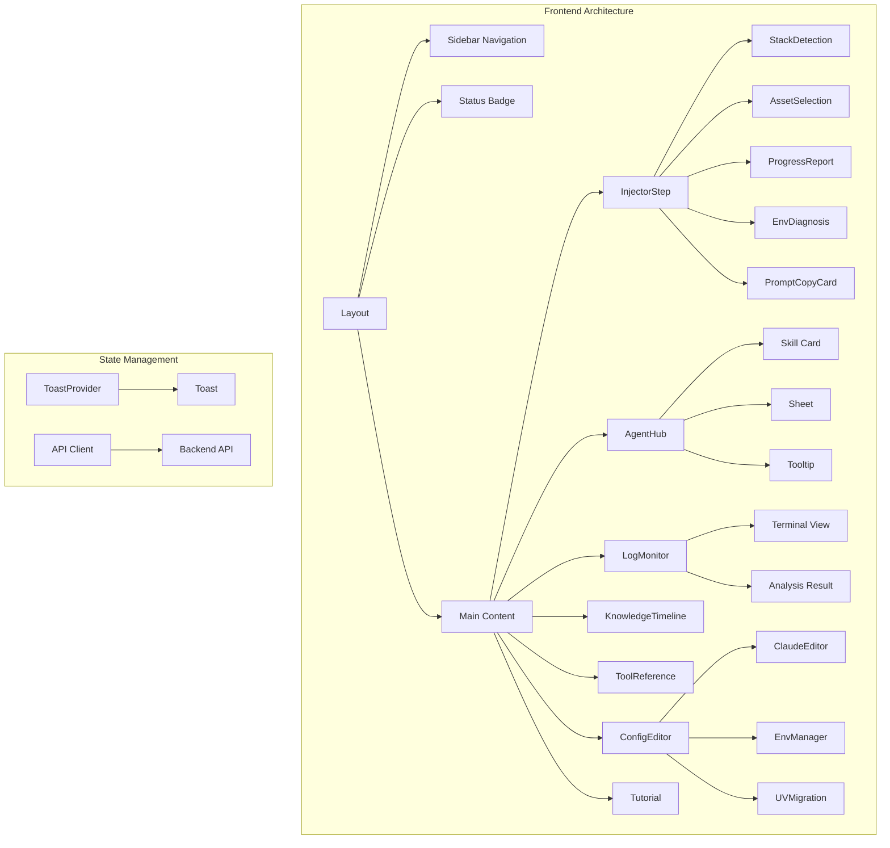
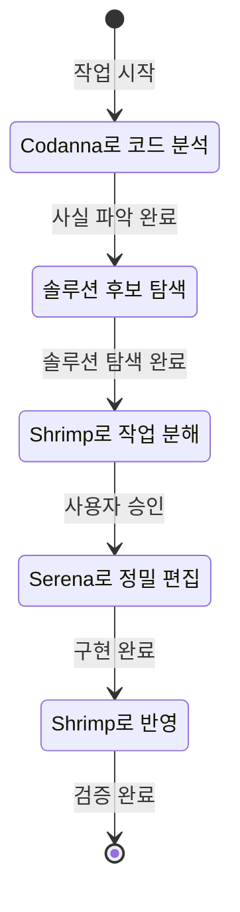
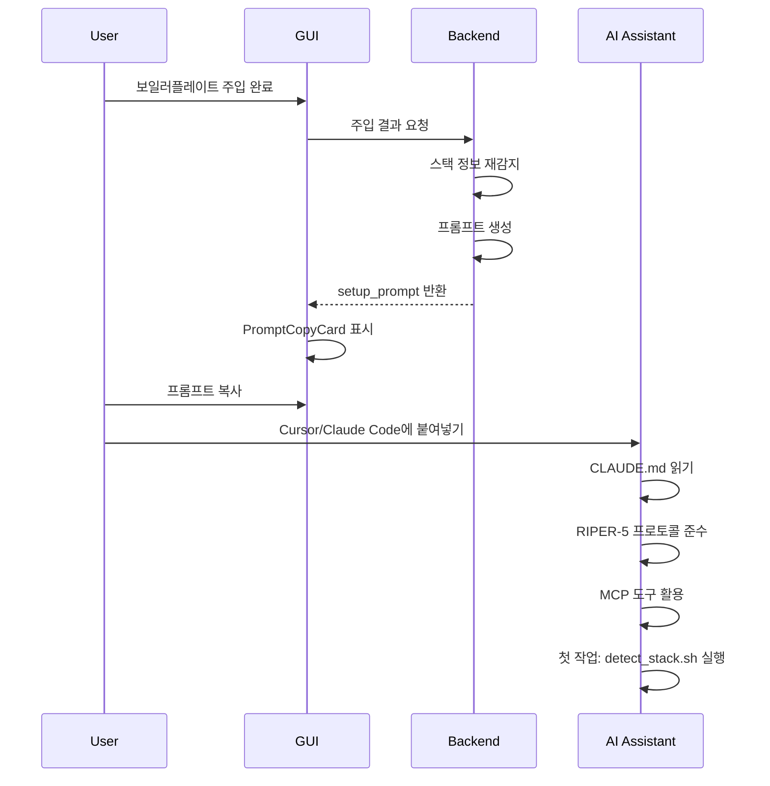
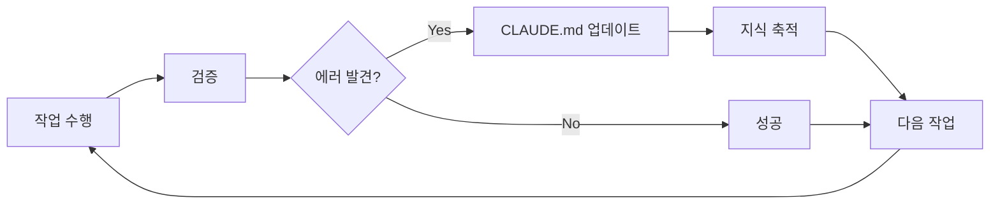

# AI-Native Boilerplate

> 팀 협업을 위한 AI-Native 프로젝트 보일러플레이트 - Boris Cherny의 "Compounding Engineering" 철학을 실무에 적용

[](LICENSE)

AI 에이전트와 함께 코드를 작성하고, 팀의 지식을 복리로 축적하여 시간이 지날수록 더 똑똑해지는 개발 환경을 구축합니다.

## 🎯 주요 특징

- **🤖 AI-Native 설계**: Claude Code, Cursor 등 AI 코딩 도구와 최적화된 워크플로우
- **📚 지식 축적**: `CLAUDE.md`를 통한 팀 단위 지식 복리화 시스템
- **🔧 Tech-Agnostic**: Node.js, Python, Go, Rust 등 다양한 스택 지원
- **✅ 검증 피드백 루프**: Plan → Execute → Verify → Human Approval 프로세스
- **🤖 Agent Skills 통합 관리**: 표준화된 서브 에이전트 시스템 (코드 분석, 보안, 로그, 시각적 검증, Git 규칙 검증)
- **🎨 GUI 기반 주입**: Phase 6 Boilerplate Injector로 기존 프로젝트에 쉽게 적용
- **🔒 안전한 자동화**: 백업, 병합, 선택적 적용으로 기존 설정 보호
- **🚀 AI 초기화 프롬프트**: 인젝션 완료 후 AI 어시스턴트를 즉시 교육할 수 있는 맞춤형 프롬프트 제공

## 🏗️ 시스템 아키텍처

```mermaid
graph TB
    subgraph "AI-Native Boilerplate"
        A[GUI Dashboard] --> B[Backend API]
        B --> C[Core Scripts]
        B --> D[Agent Skills]

        A --> E[Boilerplate Injector]
        A --> F[Agent Hub]
        A --> G[Log Monitor]
        A --> H[Knowledge Base]
        A --> I[Config Editor]

        E --> J[Stack Detection]
        E --> K[File Injection]
        E --> L[Post Diagnosis]
        E --> M[Setup Prompt Generator]

        F --> D
        D --> N[Simplifier]
        D --> O[Log Analyzer]
        D --> P[Security Audit]
        D --> Q[Visual Verifier]
        D --> R[Git Guard]

        G --> O
        H --> S[Knowledge Timeline]
        H --> T[Tool Reference]

        I --> U[CLAUDE.md Editor]
        I --> V[Env Check]
        I --> W[UV Migration]

        C --> X[detect_stack.sh]
        C --> Y[check_env.sh]
        C --> Z[verify-feedback-loop.js]
    end

    subgraph "MCP Integration"
        D --> AA[Codanna]
        D --> BB[Serena]
        D --> CC[Shrimp]
        D --> DD[Context7]
    end

    subgraph "Target Project"
        E --> EE[.claude/]
        E --> FF[scripts/]
        E --> GG[CLAUDE.md]
        E --> HH[mise.toml]
    end
```



## 📁 프로젝트 구조

```
boilerplate/
├── CLAUDE.md                      # AI 페르소나 및 팀 지식 중앙 저장소
├── spec.md                        # 프로젝트 명세 템플릿
├── mise.toml                      # 통합 툴체인 관리
├── .claude/                       # Claude Code 설정
│   ├── commands/                  # 커스텀 슬래시 커맨드
│   │   ├── verify-app.sh
│   │   ├── commit-push-pr.sh
│   │   └── review-code.sh
│   ├── hooks/                     # 자동화 훅
│   │   ├── post-tool-use.js      # 포매팅 자동화
│   │   └── stop.js                # 위험 작업 검증
│   └── settings.json              # 권한 관리
├── scripts/
│   ├── core/                      # Tech-Agnostic 스크립트
│   │   ├── detect_stack.sh        # 스택 감지
│   │   ├── auto_verify.sh         # 자동 검증
│   │   ├── commit-push-pr.sh      # Git 워크플로우
│   │   └── check_env.sh           # 환경 변수 진단
│   ├── agents/                    # Agent Skills 표준 기반 서브 에이전트
│   │   ├── simplifier.js          # 코드 단순화 분석
│   │   ├── visual_verifier.js     # 시각적 검증 (웹 프로젝트)
│   │   ├── security-audit.js      # 보안 감사
│   │   ├── log_analyzer.js        # 로컬 로그 분석
│   │   └── update_claude_knowledge.js  # 지식 복리화
│   └── verify-feedback-loop.js    # 통합 검증 루프
├── skills/                        # Agent Skills 표준 스키마 기반 스킬
│   ├── simplifier/                # 코드 단순화 스킬
│   ├── log-analyzer/              # 로그 분석 스킬
│   ├── security-audit/            # 보안 감사 스킬
│   ├── visual-verifier/           # 시각적 검증 스킬
│   ├── git-guard/                 # Git 규칙 검증 스킬
│   └── claude-knowledge-updater/  # 지식 업데이트 스킬
├── gui/                           # Phase 6: Boilerplate Injector
│   ├── backend/                   # FastAPI 백엔드
│   │   ├── app/
│   │   │   ├── api/               # API 라우터
│   │   │   │   ├── injector.py    # 주입 API
│   │   │   │   ├── agents.py      # 에이전트 실행 API
│   │   │   │   ├── logs.py        # 로그 분석 API
│   │   │   │   ├── skills.py      # 스킬 지식 API
│   │   │   │   └── config.py      # 설정 관리 API
│   │   │   ├── core/              # 핵심 로직
│   │   │   │   ├── detector.py    # 스택 감지
│   │   │   │   ├── injector.py    # 파일 주입
│   │   │   │   ├── validator.py   # 사후 진단
│   │   │   │   └── prompts.py     # 프롬프트 생성
│   │   │   └── models/            # 데이터 모델
│   │   └── requirements.txt
│   └── frontend/                  # Next.js 프론트엔드
│       ├── pages/                 # 페이지 라우트
│       │   ├── index.tsx          # 메인 대시보드
│       │   ├── skills.tsx         # Agent Skills Hub
│       │   ├── logs.tsx           # 로그 모니터
│       │   ├── knowledge.tsx      # 지식 베이스
│       │   ├── config.tsx          # 설정 편집기
│       │   └── tutorial.tsx      # 온보딩 튜토리얼
│       ├── components/            # UI 컴포넌트
│       │   ├── Layout.tsx         # 메인 레이아웃
│       │   ├── InjectorStep.tsx   # 주입 프로세스
│       │   ├── AgentHub.tsx       # 에이전트 대시보드
│       │   ├── LogMonitor.tsx     # 로그 모니터
│       │   ├── KnowledgeTimeline.tsx  # 지식 타임라인
│       │   ├── ToolReference.tsx  # 도구 참조
│       │   ├── ConfigEditor.tsx   # 설정 편집기
│       │   ├── PromptCopyCard.tsx # 프롬프트 복사
│       │   └── ...
│       └── lib/                   # 유틸리티
│           ├── api.ts             # API 클라이언트
│           └── types.ts          # 타입 정의
└── docs/
    ├── ai-onboarding.md           # AI 팀 온보딩 가이드
    └── mcp-guide.md               # MCP 서버 설정 가이드
```

## 🚀 빠른 시작

### 1. Docker를 통한 GUI 실행 (권장 - 로컬 도구 설치 불필요)

로컬에 Node.js나 Python을 설치하지 않고도 Docker로 즉시 시작할 수 있습니다:

```bash
# 1. 주입 대상 프로젝트 경로를 환경 변수로 설정 (절대 경로 필수)
export TARGET_PROJECT_PATH=/absolute/path/to/target/project
# 주의: 상대 경로는 사용하지 마세요. Docker 볼륨 마운트는 절대 경로를 요구합니다.

# 2. Docker Compose로 GUI 실행
mise run docker-up
# 또는 직접 실행
docker-compose up -d

# 3. 브라우저에서 접속
# - 프론트엔드: http://localhost:3000
# - 백엔드 API: http://localhost:8000

# 4. 로그 확인
mise run docker-logs
# 또는
docker-compose logs -f

# 5. 종료
mise run docker-down
# 또는
docker-compose down
```

**Docker 사용 시 장점**:
- 로컬 도구 설치 불필요 (Node.js, Python, uv 등)
- 격리된 환경에서 안전하게 실행
- 팀원 모두 동일한 환경 보장
- Agent Skills가 컨테이너 내에서 실행되어 호스트 시스템에 영향 없음

### 2. 로컬 환경에서 GUI 실행

```bash
# GUI 기반 주입 (Phase 6)
mise run gui
# 브라우저에서 http://localhost:3000 접속
```

GUI에서 다음 단계를 수행:
1. 대상 프로젝트 경로 입력
2. 스택 자동 감지
3. 주입할 자산 선택
4. 주입 옵션 설정 (백업, 병합 등)
5. 주입 실행
6. AI 초기화 프롬프트 복사하여 Cursor/Claude Code에 붙여넣기

### 3. 수동 설정 (GUI 없이)

```bash
# 1. 핵심 파일 복사
cp -r .claude/ scripts/ CLAUDE.md mise.toml <your-project>/

# 2. 환경 설정
cd <your-project>
mise install

# 3. 검증
mise run verify
```

## 🎨 GUI 기능 개요

### 메인 대시보드

GUI는 **Cybernetic Minimalism** 테마로 설계된 통합 대시보드입니다:



### 주요 기능

#### 1. Boilerplate Injector
- **스택 자동 감지**: Python, Node.js, Go, Rust 등 자동 인식
- **선택적 자산 주입**: 필요한 파일만 선택하여 주입
- **안전한 주입**: 백업, 병합, 건너뛰기 옵션
- **사후 진단**: Git 상태, 환경 변수 체크 (선택적)
- **AI 초기화 프롬프트**: 주입 완료 후 맞춤형 프롬프트 자동 생성

#### 2. Agent Skills Hub
- **6가지 Agent Skills**:
  - **Simplifier**: 코드 복잡도 분석 및 리팩토링 제안
  - **Log Analyzer**: 로컬 로그 분석 및 에러 추적 (Codanna/Serena 연계)
  - **Security Audit**: 보안 취약점 감사 (Python: safety, Node.js: npm/pnpm audit)
  - **Visual Verifier**: 웹 프로젝트 시각적 검증 (Chrome DevTools MCP)
  - **Git Guard**: Git Guide 규칙 준수 검증
  - **Claude Knowledge Updater**: 검증 결과를 CLAUDE.md에 자동 기록
- **실시간 실행**: 각 스킬을 개별적으로 실행하고 결과 확인
- **Instructions 확인**: 각 스킬의 상세 사용법 확인
- **Engineering Philosophy**: 각 스킬의 설계 의도 표시

#### 3. Log Monitor
- **터미널 스타일 뷰어**: 실시간 로그 모니터링
- **레벨별 색상 코딩**: ERROR, CRITICAL, WARNING, INFO 구분
- **AI 분석 연계**: 에러 로그에서 "Analyze with AI" 버튼으로 즉시 분석
- **필터링 및 검색**: 레벨별 필터, 키워드 검색

#### 4. Knowledge Base
- **Knowledge Timeline**: CLAUDE.md의 Lessons Learned를 타임라인으로 시각화
- **Tool Reference**: AI-Native 툴체인 명세 및 설계 의도 설명
  - 코어 인프라 (uv, mise, CLAUDE.md)
  - MCP 서버 (Codanna, Serena, Shrimp)
  - Agent Skills (simplifier, log-analyzer, security-audit 등)
  - 제어 평면 (GUI)

#### 5. Config Editor
- **CLAUDE.md 편집**: Lessons Learned, Team Standards 섹션 편집
- **환경변수 관리**: 수동으로 환경변수 확인 및 업데이트
- **UV 마이그레이션**: Poetry 프로젝트를 uv로 자동 마이그레이션
- **도구 상태 확인**: mise, uv, MCP, pnpm, gh 설치 상태 확인

#### 6. Tutorial
- **인터랙티브 가이드**: 3-Step Loop (Plan, Execute, Verify) 시각화
- **도구별 가이드**: 각 단계에서 사용할 도구 설명
- **AI 초기화 가이드**: 프롬프트 복사 및 사용법 안내

## 🏗️ Phase별 구현 내역

### Phase 1: AI-Native Core Knowledge System
- ✅ `CLAUDE.md`: 팀 지식 중앙 저장소
- ✅ `spec.md`: 프로젝트 명세 템플릿
- ✅ `docs/ai-onboarding.md`: 팀 온보딩 가이드

### Phase 2: Claude Code 설정 및 자동화
- ✅ `.claude/settings.json`: 권한 관리
- ✅ `.claude/commands/`: 슬래시 커맨드
- ✅ `.claude/hooks/`: 자동화 훅
- ✅ `mise.toml`: 툴체인 관리

### Phase 3: MCP 연계 및 RIPER-5 프로토콜
- ✅ `.mcp.json`: MCP 서버 설정 (Serena, Codanna, Shrimp, Context7 등)
- ✅ RIPER-5 프로토콜 통합
- ✅ `docs/mcp-guide.md`: MCP 설정 가이드

### Phase 4: Tech-Agnostic 엔진
- ✅ `scripts/core/detect_stack.sh`: 스택 감지 엔진
- ✅ `scripts/core/auto_verify.sh`: 자동 검증
- ✅ `scripts/core/commit-push-pr.sh`: Git 워크플로우
- ✅ `scripts/core/check_env.sh`: 환경 변수 진단

### Phase 5: Agent Skills 표준 기반 서브에이전트 및 검증 피드백 루프
- ✅ `scripts/agents/`: Agent Skills 표준 기반 에이전트 라이브러리
  - `simplifier.js`: 코드 단순화 및 복잡도 분석
  - `visual_verifier.js`: 웹 프로젝트 시각적 검증 (Chrome DevTools MCP)
  - `security-audit.js`: 보안 취약점 감사 (Python: safety, Node.js: npm/pnpm audit)
  - `log_analyzer.js`: 로컬 로그 분석 및 에러 추적 (Codanna/Serena MCP 연계)
  - `update_claude_knowledge.js`: 검증 결과를 CLAUDE.md에 자동 기록
- ✅ `scripts/verify-feedback-loop.js`: 통합 검증 루프 (모든 에이전트 조율)
- ✅ `gui/backend/app/api/agents.py`: GUI 기반 에이전트 통합 관리 API
- ✅ `gui/frontend/components/AgentHub.tsx`: 에이전트 대시보드 UI

### Phase 6: GUI 기반 Boilerplate Injector (완료)

#### 백엔드 (FastAPI)
- ✅ 스택 감지 API (`/api/v1/detect`)
- ✅ 파일 주입 API (`/api/v1/inject`)
  - 선택적 자산 주입
  - 백업, 병합, 건너뛰기 옵션
  - 사후 진단 (Git 상태, 환경변수 체크 - 선택적)
  - AI 초기화 프롬프트 자동 생성
- ✅ 에이전트 실행 API (`/api/v1/agents/run`, `/api/v1/agents/run/stream`)
- ✅ 로그 분석 API (`/api/v1/logs/analyze`, `/api/v1/logs/read`)
- ✅ 스킬 지식 API (`/api/v1/skills/{skill_name}/instructions`, `/api/v1/skills/claude/lessons`)
- ✅ 설정 관리 API (`/api/v1/config/*`)

#### 프론트엔드 (Next.js + SvelteKit → Next.js로 전환)
- ✅ **Cybernetic Minimalism 테마**: Zinc-950 배경, Indigo-500 액센트
- ✅ **메인 레이아웃**: 슬림 사이드바 네비게이션, 전역 상태 배지
- ✅ **Boilerplate Injector**: 스택 감지 → 자산 선택 → 주입 실행 → 프롬프트 생성
- ✅ **Agent Skills Hub**: 카드 기반 그리드, 실시간 실행, Instructions 표시
- ✅ **Log Monitor**: 터미널 스타일, 레벨별 색상 코딩, AI 분석 연계
- ✅ **Knowledge Base**: 타임라인 시각화, 도구 참조 가이드
- ✅ **Config Editor**: CLAUDE.md 편집, 환경변수 관리, UV 마이그레이션
- ✅ **Tutorial**: 인터랙티브 3-Step 가이드, AI 초기화 안내
- ✅ **AI Setup Prompt**: 인젝션 완료 후 맞춤형 프롬프트 생성 및 복사

## 💻 사용 방법

### 기본 워크플로우



1. **Plan 모드**: 작업 시작 전 계획 수립
   ```
   [MODE: PLAN]
   이 기능을 구현하기 위한 계획을 세워줘
   ```

2. **Execute 모드**: 계획 승인 후 구현
   ```
   [MODE: EXECUTE]
   계획대로 구현해줘
   ```

3. **Verify**: 통합 검증 실행 (Agent Skills 표준 기반)
   ```bash
   # 통합 검증 루프 (모든 에이전트 자동 실행)
   # boilerplate 프로젝트에서 실행하고, 대상 프로젝트 경로를 인자로 전달
   node scripts/verify-feedback-loop.js [target_directory]

   # 예시: 다른 프로젝트에서 검증
   node scripts/verify-feedback-loop.js /path/to/target/project

   # 또는 기본 검증만
   mise run verify
   # 또는

## 🔄 Post-Injection Workflow (주입 후 워크플로우)

보일러플레이트 주입이 완료된 후, **주입된 프로젝트는 자생적인 AI-Native 생태계로 동작**해야 합니다. 원본 보일러플레이트와 분리되어 독립적으로 운영됩니다.

### 핵심 원칙

**주입된 프로젝트 내부에서 GUI를 실행해야 합니다.**

인젝션 완료 후에는 다음 단계를 수행하세요:

1. **원본 보일러플레이트 GUI 종료**
   - 현재 실행 중인 보일러플레이트 GUI를 종료합니다.

2. **주입된 프로젝트로 이동**
   ```bash
   cd /path/to/injected/project
   ```

3. **프로젝트 전용 GUI 실행**
   ```bash
   mise run gui
   ```

### 독립적인 Control Plane

주입된 프로젝트 내부에서 GUI를 실행하면:

- **로컬 로그 매핑**: 프로젝트의 `app.log` 파일이 실시간으로 GUI에 표시됩니다
- **프로젝트 전용 Agent Hub**: 해당 프로젝트에 맞게 커스터마이징된 `instructions.md`와 `schema.json`을 기반으로 에이전트 스킬을 관리할 수 있습니다
- **지식 업데이트**: GUI를 통해 수정된 `CLAUDE.md`의 내용이 해당 프로젝트 폴더 내에 즉시 저장되어 AI의 다음 작업에 반영됩니다
- **독립적 환경**: 주입된 `gui/backend`는 이제 원본 프로젝트가 아닌 **현재 프로젝트의 루트**를 기준으로 동작합니다

### 워크플로우 다이어그램



**이유**: 각 프로젝트는 독립적인 AI-Native 생태계로 동작해야 하며, 원본 보일러플레이트와의 혼선을 방지하기 위함입니다.

   # 또는
   .claude/commands/verify-app.sh
   ```

4. **Human Approval**: 최종 승인

### 주요 명령어

```bash
# 검증 (lint, type-check, test)
mise run verify

# 통합 검증 루프 (Agent Skills 기반)
# 대상 프로젝트 경로를 인자로 전달하면 해당 프로젝트에서 검증
node scripts/verify-feedback-loop.js [target_directory]

# 개별 에이전트 실행
# 대상 프로젝트 경로를 인자로 전달하면 해당 프로젝트에서 분석
node scripts/agents/simplifier.js [target_directory]      # 코드 단순화 분석
node scripts/agents/security-audit.js [target_directory]  # 보안 감사
node scripts/agents/log_analyzer.js [target_directory] [log_file]    # 로그 분석
node scripts/agents/visual_verifier.js [target_directory] [port]     # 시각적 검증 (웹 프로젝트)
node scripts/agents/git-guard.js [target_directory]     # Git 규칙 검증

# 예시: 다른 프로젝트에서 개별 에이전트 실행
node scripts/agents/security-audit.js /path/to/target/project
node scripts/agents/log_analyzer.js /path/to/target/project /path/to/app.log

# 주의사항:
# - 모든 Agent는 boilerplate 프로젝트 디렉토리에서 실행해야 합니다
# - 대상 프로젝트 경로를 인자로 전달하지 않으면 현재 작업 디렉토리를 사용합니다
# - 스택이 감지되지 않은 경우, Agent는 경고만 표시하고 계속 진행합니다

# 포매팅
mise run format

# 테스트
mise run test

# PR 생성 전 검토
mise run pre-pr

# GUI 실행 (Phase 6)
mise run gui
```

### 슬래시 커맨드 (Cursor/Claude Code)

- `/verify-app`: 종합 검증 실행
- `/commit-push-pr`: Git 커밋 및 PR 생성
- `/review-code`: 코드 리뷰 노트를 CLAUDE.md에 추가

## 🤖 Agent Skills 상세

### Agent Skills 아키텍처



### 각 Agent Skill 설명

| Skill | 목적 | MCP 연계 | 출력 |
|-------|------|----------|------|
| **Simplifier** | 코드 복잡도 분석 및 리팩토링 제안 | Codanna (코드 분석) | 복잡도 점수, 개선 제안 |
| **Log Analyzer** | 로컬 로그 분석 및 에러 추적 | Codanna/Serena (에러 위치 찾기) | 에러 목록, 코드 가이드 |
| **Security Audit** | 보안 취약점 감사 | - | 취약점 목록, 업데이트 제안 |
| **Visual Verifier** | 웹 프로젝트 시각적 검증 | Chrome DevTools MCP | 렌더링 스크린샷, 콘솔 에러 |
| **Git Guard** | Git Guide 규칙 준수 검증 | - | 규칙 위반 목록, 수정 제안 |
| **Claude Knowledge Updater** | 검증 결과를 CLAUDE.md에 기록 | - | 업데이트된 CLAUDE.md |

## 🎨 GUI 컴포넌트 구조



## 🔄 RIPER-5 프로토콜 워크플로우



### RIPER-5 모드별 상세

| 모드 | 목적 | 필수 도구 | 주요 활동 |
|------|------|----------|----------|
| **RESEARCH** | 사실 기반 분석 | Codanna | 시맨틱 검색, 심볼 분석 |
| **INNOVATE** | 솔루션 탐색 | - | 접근 방식 브레인스토밍 |
| **PLAN** | 기술 명세 작성 | Shrimp, Codanna | 작업 분해, 영향 분석 |
| **EXECUTE** | 정밀 구현 | Serena | 심볼 기반 편집 |
| **REVIEW** | 검증 및 반영 | Shrimp | 계획 일치 확인 |

## 🛠️ AI-Native 툴체인 명세

### 코어 인프라

| 도구 | 설명 | 설계 의도 |
|------|------|-----------|
| **uv** | Rust 기반 초고속 Python 패키지 관리자 | `pyenv`, `poetry`, `pip`를 하나로 통합하여 환경 구축 시간 단축 |
| **mise** | 프로젝트별 개발 도구 관리 | 팀원 모두가 동일한 툴체인 버전 사용 강제, 표준화된 명령어 제공 |
| **CLAUDE.md** | AI 전용 메모리 | 세션이 바뀌어도 AI가 프로젝트 컨텍스트를 잃지 않게 함, 지식 복리화 |

### MCP 서버

| MCP 서버 | 역할 | 설계 의도 |
|----------|------|-----------|
| **Codanna** | 시맨틱 검색 및 사실 분석 | AI가 코드를 '추측'하지 않고 '사실'에 기반하여 정확히 파악 |
| **Serena** | 심볼 단위 정밀 편집 | IDE 수준의 정밀도로 필요한 부분만 수정 (Surgical Precision) |
| **Shrimp** | 구조화된 작업 관리 | AI가 무작정 코딩하지 않고 PLAN 단계에서 명확한 할 일 목록 작성 |

### Agent Skills

| 스킬 | 설명 | 설계 의도 |
|------|------|-----------|
| **simplifier** | 코드 복잡도 측정 및 리팩토링 제안 | 인간과 AI 모두가 이해하기 쉬운 '간결함' 유지 |
| **log-analyzer** | 로컬 로그 분석 및 에러 진단 | 외부 서비스 의존 없이 로컬 개발 단계에서 에러 근본 원인 파악 |
| **security-audit** | 패키지 취약점 실시간 모니터링 | 개발 초기 단계부터 보안 가드레일 적용 |
| **visual-verifier** | 웹 프로젝트 시각적 검증 | 브라우저를 직접 열고 UI 품질 확인 |
| **git-guard** | Git Guide 규칙 준수 검증 | 팀의 Git 워크플로우 일관성 유지 |

### 제어 평면

| 구성 요소 | 설명 | 설계 의도 |
|----------|------|-----------|
| **GUI Dashboard** | FastAPI + Next.js 통합 대시보드 | CLI에 익숙하지 않은 사용자도 AI-Native 워크플로우에 쉽게 적응 |

## 🚀 AI 초기화 프롬프트 기능

인젝션 완료 후 AI 어시스턴트를 즉시 교육할 수 있는 맞춤형 프롬프트를 자동 생성합니다.



### 프롬프트 구성 요소

1. **지식 베이스 확인**: CLAUDE.md 필독 지시
2. **프로토콜 준수**: RIPER-5 프로토콜 엄격 준수
3. **MCP 도구 활용**: Codanna, Serena, Shrimp 사용 지침
4. **환경 표준**: 패키지 관리자 및 검증 방법 안내
5. **스택 정보**: 프로젝트 스택 동적 삽입
6. **첫 작업**: detect_stack.sh 실행 지시

## 💻 사용 방법

### GUI를 통한 워크플로우

1. **보일러플레이트 주입**
   - GUI 접속: `mise run gui` → http://localhost:3000
   - 프로젝트 경로 입력 및 스택 감지
   - 주입할 자산 선택
   - 주입 실행
   - AI 초기화 프롬프트 복사

2. **Agent Skills 실행**
   - Agent Skills Hub에서 원하는 스킬 선택
   - 대상 프로젝트 경로 입력 (선택적)
   - 실행 버튼 클릭
   - 실시간 로그 확인 및 결과 분석

3. **로그 모니터링**
   - Log Monitor에서 실시간 로그 확인
   - 에러 발생 시 "Analyze with AI" 버튼으로 즉시 분석

4. **지식 관리**
   - Knowledge Base에서 Lessons Learned 타임라인 확인
   - Tool Reference에서 각 도구의 설계 의도 학습
   - Config Editor에서 CLAUDE.md 직접 편집

### CLI를 통한 워크플로우

기존 CLI 명령어는 그대로 사용 가능하며, GUI는 선택적입니다.

## 🔧 환경 설정

### 필수 도구

- [mise](https://mise.jdx.dev/): 툴체인 관리
- Node.js 18+ (프론트엔드)
- Python 3.11+ (백엔드, 선택사항)
- [uv](https://github.com/astral-sh/uv): Python 패키지 관리 (권장)
- [pnpm](https://pnpm.io/): Node.js 패키지 관리 (권장)
- [gh](https://cli.github.com/): GitHub CLI (선택사항)

### 설치

```bash
# mise 설치 (macOS)
brew install mise

# 도구 설치
mise install

# 프로젝트 의존성 설치
# Python 프로젝트인 경우
cd gui/backend && pip install -r requirements.txt
# 또는 uv 사용
cd gui/backend && uv pip install -r requirements.txt

# Node.js 프로젝트인 경우
cd gui/frontend && npm install
# 또는 pnpm 사용
cd gui/frontend && pnpm install
```

## 📚 문서

- [AI 온보딩 가이드](docs/ai-onboarding.md): AI와 함께 작업하는 방법
- [MCP 가이드](docs/mcp-guide.md): MCP 서버 설정 및 사용법

## 🎓 핵심 개념

### Compounding Engineering

Boris Cherny의 철학으로, AI 에이전트가 과거 실수를 학습하여 시간이 지날수록 더 똑똑해지는 시스템:



- **지식 축적**: `CLAUDE.md`에 Lessons Learned 자동 기록
- **Anti-patterns**: 반복되는 실수 방지
- **Best Practices**: 검증된 패턴 축적

### RIPER-5 프로토콜

구조화된 AI 개발 워크플로우:

- **RESEARCH**: 사실 기반 분석 (Codanna 활용)
- **INNOVATE**: 솔루션 탐색
- **PLAN**: 상세 기술 명세 작성 (Shrimp Task Manager)
- **EXECUTE**: 정밀 편집 (Serena 활용)
- **REVIEW**: 검증 및 반영

### Tech-Agnostic 원칙

특정 프레임워크에 종속되지 않고, 프로젝트의 스택을 자동 감지하여 적절한 도구를 사용:

- `detect_stack.sh`로 스택 자동 감지
- 스택별 검증 도구 자동 실행
- `mise.toml`로 툴체인 통합 관리

## 🔒 보안

- **권한 관리**: `.claude/settings.json`에서 화이트리스트 기반 권한 제어
- **Stop 훅**: 위험한 작업(DB 마이그레이션, 인프라 변경) 시 사용자 승인 요구
- **환경 변수 보안**: `check_env.sh`에서 실제 값 노출 방지 (KEY 이름만 비교)

## 🤝 기여

1. Issue 생성
2. Feature 브랜치 생성: `feature/{issue_number}-description`
3. 변경사항 커밋: `Resolved #{issue_number} - {description}`
4. PR 생성: `Resolved #{issue_number} - {issue 이름}`
5. 리뷰 후 병합

## 📝 라이선스

MIT License

## 🙏 감사의 글

이 프로젝트는 다음 영감을 받았습니다:

- [Boris Cherny의 Compounding Engineering](https://news.hada.io/topic?id=25570)
- [fullstack-starter](https://github.com/first-fluke/fullstack-starter)
- Claude Code 및 Cursor의 AI-Native 개발 환경
